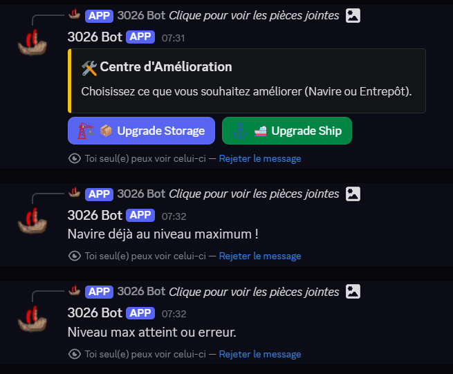
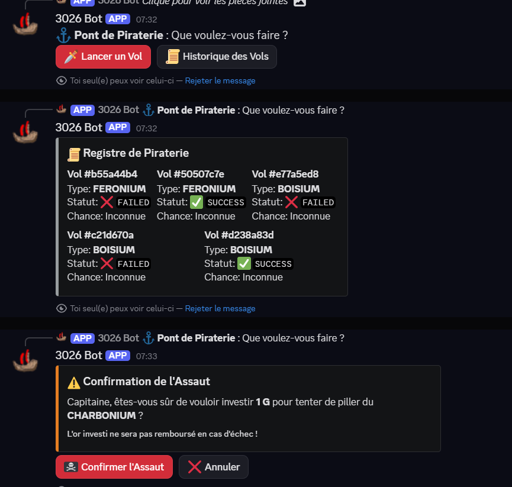
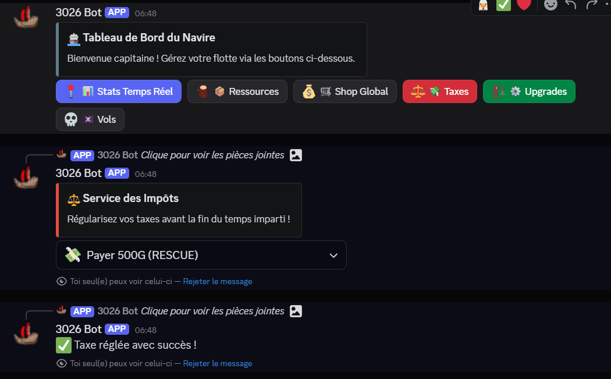

# 🏴‍☠️ Bot Discord & Outils d'Automatisation - Jeu 3026 (Hackathon)

Ce dépôt contient les scripts Python développés dans le cadre du hackathon (Jeu 3026). Ce projet offre un Bot Discord interactif, des scripts d'automatisation et une architecture API robuste pour dominer la partie en optimisant chaque action.

---

## ⚙️ Architecture du Projet & Classes API

Pour interagir proprement avec le serveur du jeu sans dupliquer de code, nous avons structuré nos appels HTTP autour d'un système de classes orienté objet. 

### 📡 La classe mère : `Api`
C'est le cœur du réacteur. Cette classe de base gère toute la tuyauterie HTTP :
* **Authentification :** Elle injecte automatiquement le header `codinggame-id` (Token JWT) dans toutes les requêtes.
* **Gestion des erreurs :** Elle intercepte les codes HTTP (comme les 400 ou les 429 *Too Many Requests*) et formate les erreurs proprement.
* **Méthodes génériques :** Elle expose des fonctions `get()`, `post()`, `put()`, et `patch()` prêtes à l'emploi.

Les autres classes héritent de (ou utilisent) cette classe `Api` pour cibler des routes spécifiques :

* 🛒 **`MarketAPI` :** Gère les routes `/marketplace/offers` et `/marketplace/purchases`. Permet de lister les offres, d'acheter et de vendre des ressources.
* 🚨 **`TaxeAPI` :** Gère la route `/taxes`. Permet de vérifier les amendes en cours (`DUE`) et d'automatiser leur paiement (`/taxes/{taxId}`).
* ⚔️ **`TheftAPI` :** Gère la route `/thefts/player`. Permet d'envoyer les paramètres d'attaque (type de ressource et montant en Or) pour piller les autres joueurs.

---

## 🤖 Programmes d'Automatisation (Bots Python)

Le dashboard est présenté sous la forme d'un bot discord.

### 🎯 Le Market Sniper (Alertes de Prix sur Discord)
Acheter au bon moment est crucial pour évoluer vite. Nous avons intégré un système de **Sniping** directement relié à notre Bot Discord :
1. Vous définissez un prix cible (ex: "Je veux une alerte si le BOISIUM passe sous les 2 G/unité").
2. Le Sniper scanne les offres en temps réel (en lisant notre fichier de cache local, sans spammer l'API).
3. Dès qu'un joueur met en vente une ressource à un prix inférieur ou égal à votre seuil, **le bot envoie immédiatement une notification (Ping) sur Discord !**
4. Vous pouvez alors bondir sur l'occasion et acheter les ressources avant tout le monde.
> 

---

## 📖 Mécaniques de Jeu (Features)

Le bot gère et facilite l'accès aux mécaniques principales du jeu 3026 :

### 💎 Les Ressources
Le jeu tourne autour de 4 ressources fondamentales. L'**OR** sert de monnaie d'échange, tandis que le **FERONIUM**, le **BOISIUM** et le **CHARBONIUM** servent à l'artisanat et aux améliorations.
> 

### ⬆️ Les Améliorations (Upgrades)
Pour explorer plus loin, il faut investir ! Le bot permet de suivre les coûts pour améliorer le **Bateau** (vitesse, vision, portée) et l'**Entrepôt / Storage** (pour stocker plus de ressources sans déborder).
> 

### ⚔️ Les Vols (Thefts)
La mécanique PvP par excellence. Vous pouvez investir de l'Or pour envoyer des pirates piller le joueur le plus riche du serveur sur une ressource ciblée. Le bot propose un formulaire sécurisé sur Discord (Modal) pour éviter les erreurs de frappe ruineuses !
> 

### 🚨 Les Taxes
Tomber en panne d'énergie en pleine mer coûte cher. Le jeu vous sauve, mais vous inflige une taxe de secours (`RESCUE`). Nos outils (via la `TaxeAPI`) permettent de les repérer et de les payer instantanément.
> 

En plus du bot Discord interactif, nous avons développé des scripts autonomes qui tournent en tâche de fond pour optimiser notre économie.

### 📦 L'Auto-Seller (Gestionnaire de Stock)
Dans le jeu, l'entrepôt a une limite stricte. Si vos bateaux ramènent des ressources alors que l'entrepôt est plein, ces ressources sont perdues ! 
**Comment fonctionne ce script ?**
1. Il interroge régulièrement les détails du joueur via l'API.
2. Il vérifie la quantité actuelle de chaque ressource (FERONIUM, BOISIUM, CHARBONIUM).
3. Si une ressource dépasse un certain seuil (ex: 90% de la capacité maximale), le bot crée automatiquement une offre de vente via la `MarketAPI`.
4. **Résultat :** L'entrepôt ne déborde jamais, et l'équipe s'enrichit en Or (G) en continu, même quand on ne joue pas !
---

## 🏪 Le Marché (Shop) & Le Système de Broker

Pour gérer l'économie sans se faire bannir par le serveur (Erreur HTTP 429), nous avons développé un système de **Broker** intelligent pour le Marché (`Marketplace`).

### Fonctionnalités du Shop :
* **Consulter les offres :** Voir qui vend quoi et à quel prix.
* **Créer des offres :** Mettre en vente nos surplus de ressources.
* **Acheter :** Acquérir instantanément les ressources manquantes pour notre prochaine amélioration.

### 🧠 Le Broker (Mise en cache JSON)
L'API du marché est très sollicitée. Si nos scripts, le Sniper et le bot Discord demandaient la liste des offres toutes les secondes, l'API bloquerait notre équipe. 
**La solution :**
1. Un seul script dédié (Le Broker) interroge l'API à intervalles réguliers et raisonnables.
2. Il sauvegarde immédiatement toutes les offres actives dans un fichier local **`shop.json`**.
3. Lorsque les joueurs sur Discord ou nos bots automatiques veulent consulter le marché, ils lisent le fichier `shop.json` instantanément, **sans faire aucune requête HTTP vers le serveur du jeu**.
4. Cela garantit une interface ultra-fluide, permet au Sniper d'être ultra-réactif, et protège totalement notre limite de requêtes (Rate Limit) !

> 
---

## 🗄️ Communication Base de Données (Locale)
Notre infrastructure lit intelligemment notre base de données SQLite locale (`world.db`). Cela permet d'analyser la carte hors-ligne : compter le nombre exact de tuiles découvertes, lister les îles connues, etc..

